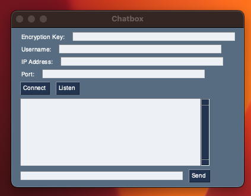
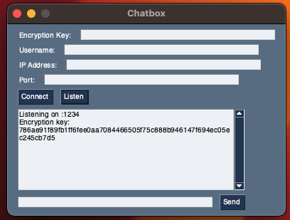

# Encrypted Chat
This is a small project I've done in order to understand a little more about NaCl, secretbox, and encryption in general.

To run it, create a virtual env, install the dependencies, and run the `main.py` file, like this
```
$ python -m venv env
$ source ./env/bin/activate
$ (env) pip install -r requirements.txt
$ (env) python main.py
```

The program looks like this.



It is pretty basic and simple to use!
Imagine you want to have a private chat with your friend, to talk about... Business. So, you just click on the _Listen_ button.

Once you clicked, an _encryption_ key will be generated. You will share the key and your IP to that friend, in order to stablish a connection.



It is not that safe to use though, as the key is shared in the first message to do the handshake, but anyways, I didn't wanted to do a perfect encrypted chat, just experiment and play with encryption and sockets to learn something new.

Anyways, I hope you enjoy reading the code (if you are one of these). Have a great day!
